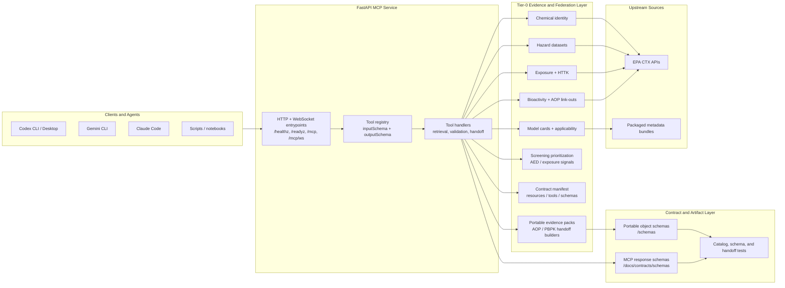

# EPA CompTox MCP Server [](https://github.com/ToxMCP/comptox-mcp/actions/workflows/ci.yml) [](https://doi.org/10.64898/2026.02.06.703989) [](./LICENSE) [](https://github.com/ToxMCP/comptox-mcp/releases) [](https://www.python.org/)

> Part of **ToxMCP** Suite -> https://github.com/ToxMCP/toxmcp
>
> **Public MCP endpoint for EPA Computational Toxicology (CompTox) evidence federation.** Expose chemical identity, hazard, exposure, bioactivity, metadata, screening-prioritization summaries, contract-manifest discovery, and cross-suite handoff builders to any MCP-aware agent (Codex CLI, Gemini CLI, Claude Code, etc.).

## Architecture



The current implementation follows a layered model:

- `FastAPI + JSON-RPC` expose `/mcp` and `/mcp/ws`, with `/healthz` and `/readyz` kept separate from domain logic.
- `Retrieval resources` own CompTox-native evidence access for chemical, hazard, exposure, bioactivity, cheminformatics, and metadata.
- `Screening prioritization` stays separate from interop builders and emits explicitly caveated AED/exposure prioritization summaries instead of final risk decisions.
- `Contract manifest` publishes the live public catalog plus schema inventory in machine-readable form for downstream MCP consumers.
- `Interop tools` package portable evidence objects for downstream MCP consumers without cloning AOP OECD semantics or PBPK execution semantics.
- `Contract layers` are split intentionally: `docs/contracts/schemas/` for MCP response wrappers, `schemas/` for cross-suite portable evidence objects.
- `Regression gates` keep README, live discovery, published schemas, and AOP/PBPK handoff fixtures aligned before release.

## What's New In v0.2.3

This release focuses on **audit hardening, privacy controls, provenance capture, and workflow governance** in response to the ToxMCP internal audit review. No public MCP boundary changes were made.

### Security & Privacy
- **Deterministic audit hashing**: every audit event emitted to a registered sink now carries tamper-evident metadata (`contentHash`, `previousHash`, `sequence`, `timestamp`) and can be verified with `audit.verify_event_hash()`.
- **Sensitive identifier scrubbing**: audit logs no longer record raw DTXSID, CASRN, SMILES, InChI, or InChIKey values in plaintext. Identifiers are hashed with a deterministic salt so the same value maps to the same hash across events.
- **Privacy-aware parameter logging**: `MCPServer._scrub_params_for_audit()` inspects tool parameters before audit emission and automatically hashes chemical identifiers and identifier-like query strings.

### Provenance & Traceability
- **Response hash capture**: `BaseResource` now records a SHA-256 hash of every serialized upstream response alongside `retrieved_at` and `retry_count` via `get_last_provenance()`.
- **Bundle chain integrity**: `AuditBundleStore.save()` links each persisted bundle to the previous bundle hash. `verify_chain()` detects tampering, checksum mismatches, or missing files.
- **Distributed trace propagation**: HTTP transport extracts or generates a W3C-style `traceId` from the `traceparent` header and passes it through tool execution audit events.
- **Runtime provenance envelope**: every orchestrator bundle now includes a `provenance` section with `serverVersion`, `runtimeEnvironment`, `traceId`, `createdAt`, and `upstreamProvenance`.

### Workflow Governance
- **AD hard-gating by default**: `GenRAOrchestrator.run_workflow()` now defaults `require_ad_clearance` to `True` when predictive tasks are present. Callers who explicitly pass `requireAdClearance=False` remain unaffected.
- **Clearer denied vs error semantics**: hard applicability-domain failures now set bundle `status` to `"denied"`, while generic predictive errors continue to map to `"error"`.
- **Advisory review checkpoints**: every bundle now includes `reviewCheckpoints` metadata (`chemical_id_confirmation`, `ad_assessment`, `final_report`) to seed future pause/approve UX without breaking synchronous callers.

### Testing
- Added `test_audit_hardening.py`, `test_audit_privacy.py`, `test_provenance_capture.py`, `test_trace_propagation.py`, `test_bundle_provenance.py`, and `test_orchestrator_ad_gating.py` to cover the new controls end-to-end.

## What's New In v0.2.2

- Published a clean `v0.2.2` patch-release layer over the already-shipped `0.2.1` public-surface hardening work, without changing the default MCP boundary.
- Aligned README, architecture notes, changelog, and release metadata around the current patch version so downstream users see one coherent release story.
- Kept the protected-branch release path CI-clean by removing broken docs-link assumptions and normalizing formatting/import ordering across the touched Python and test files.
- Left the public server role unchanged: CompTox MCP remains an evidence-federation and screening-prioritization surface, while predictive and orchestrator modules stay experimental.

See the full release notes in [`docs/releases/v0.2.2_release_description.md`](docs/releases/v0.2.2_release_description.md).

## Published Schemas

The portable CompTox handoff objects are now published as machine-readable JSON Schemas under `schemas/`, with matching examples under `schemas/examples/`.

Published object family:

- `schemas/chemicalIdentityRecord.v1.json`
- `schemas/hazardEvidenceSummary.v1.json`
- `schemas/exposureEvidenceSummary.v1.json`
- `schemas/bioactivityEvidenceSummary.v1.json`
- `schemas/aopLinkageSummary.v1.json`
- `schemas/pbpkContextBundle.v1.json`
- `schemas/comptoxEvidencePack.v1.json`

Design intent:

- keep the stable core fields required and allow additive convenience fields
- keep AOP OECD normalization outside CompTox MCP
- keep PBPK execution, qualification, and internal exposure objects outside CompTox MCP
- make the portable evidence layer consumable by downstream validators and orchestrators without scraping examples out of tests

See `schemas/README.md`, `tests/test_portable_schemas.py`, and `tests/test_cross_suite_handoffs.py` for the maintainer gates that keep published objects aligned with live payload generation.

## Why this project exists

Regulatory and research teams rely on the CompTox API for high-quality chemical, exposure, and hazard data. Traditional workflows involve bespoke scripts or manual dashboard exports that are hard to share with AI copilots.  

The EPA CompTox MCP server wraps those workflows in a **secure, programmable interface**:

- **One MCP surface (`/mcp` HTTP + `/mcp/ws` WebSocket)** delivers discovery and execution across chemical, bioactivity, exposure, hazard, metadata, interop, and supporting utility catalogues.
- **Screening prioritization** adds a separate, caveated signal-ranking path built from CompTox AED and exposure sources without claiming final NGRA decisions.
- **Contract manifest discovery** exposes the live public resources, tools, and schema inventory so downstream MCPs do not need to scrape docs to integrate safely.
- **Evidence federation role** – CompTox acts as the suite's source-grounded evidence ingress layer for downstream AOP, PBPK, O-QT, and orchestration workflows.
- **Guardrails + provenance** – JSON Schema validation, metadata attachments, transport audit hooks, and signed release attestations improve downstream reproducibility.
- **Agent friendly** – tested with Codex CLI, Gemini CLI, and Claude (see [integration guide](docs/integration_guides/mcp_integration.md)).

> Experimental predictive and orchestrator components still exist in this repository, but they are not part of the default public MCP tool catalog exposed by the server today.

---

## Feature snapshot

| Capability | Description |
| --- | --- |
| 🌐 **Dual MCP Transports** | JSON-RPC over HTTP (`/mcp`) and WebSocket (`/mcp/ws`) with identical tool catalogues. |
| 🧬 **CompTox Tooling** | Chemical, bioactivity, exposure, hazard, metadata, and supporting utility helpers mapped to structured MCP tools. |
| 🔗 **Evidence Federation** | Designed as the suite's Tier-0 evidence ingress layer, packaging source-grounded CompTox outputs for downstream consumers. |
| 🛡️ **Guardrail Enforcement** | JSON Schema response validation, metadata attachments, audit hooks, and transport safety controls improve reproducibility. |
| ⚙️ **Configurable by Design** | Pydantic settings with `.env` support for API keys, retries, auth bypass, transport tuning, and observability. |
| 🤖 **Agent Ready** | Verified with Codex CLI, Gemini CLI, and Claude Code; includes quick-start config snippets. |

---

## Table of contents

1. [Architecture](#architecture)
2. [Published schemas](#published-schemas)
3. [Quick start](#quick-start)
4. [Release verification](#release-verification)
5. [Configuration](#configuration)
6. [Tool catalog](#tool-catalog)
7. [Running the server](#running-the-server)
8. [Integrating with coding agents](#integrating-with-coding-agents)
9. [Output artifacts](#output-artifacts)
10. [Security checklist](#security-checklist)
11. [Current limitations](#current-limitations)
12. [Development notes](#development-notes)
13. [Contributing](#contributing)
14. [Security policy](#security-policy)
15. [Support](#support)
16. [Code of conduct](#code-of-conduct)
17. [Citation](#citation)
18. [Roadmap](#roadmap)
19. [License](#license)

---

## Quickstart TL;DR

```bash
# 1) install
git clone https://github.com/ToxMCP/comptox-mcp.git
cd comptox-mcp
pip install -e .

# 2) configure
cp .env.example .env
# set CTX_API_KEY in .env

# 3) run
uvicorn epacomp_tox.transport.websocket:app --host 0.0.0.0 --port 8000 --reload

# 4) verify
curl -s http://localhost:8000/healthz | jq .
curl -s http://localhost:8000/mcp \
  -H 'Content-Type: application/json' \
  -d '{"jsonrpc":"2.0","id":1,"method":"tools/list","params":{}}' | jq '.result.tools | length'
```

## Quick start

```bash
git clone https://github.com/ToxMCP/comptox-mcp.git
cd comptox-mcp
pip install -e .
cp .env.example .env
uvicorn epacomp_tox.transport.websocket:app --reload
```

> **Important:** The server needs a valid EPA CompTox API key. Set `CTX_API_KEY` (preferred) or `EPA_COMPTOX_API_KEY` in `.env` before starting the transport.

With the server running, MCP clients can connect to `http://localhost:8000/mcp` (HTTP) or `ws://localhost:8000/mcp/ws` (WebSocket).

Once the server is running:

- HTTP MCP endpoint: `http://localhost:8000/mcp`
- WebSocket MCP endpoint: `ws://localhost:8000/mcp/ws`
- Health check: `http://localhost:8000/healthz`
- Readiness check: `http://localhost:8000/readyz`
- Architecture docs: `docs/architecture_overview.md`
- Contract docs: `docs/contracts/README.md`
- Release verification guide: `docs/releases/release_artifact_verification.md`

## Verification (smoke test)

Once the server is running:

```bash
# health
curl -s http://localhost:8000/healthz | jq .

# list MCP tools
curl -s http://localhost:8000/mcp \
  -H 'Content-Type: application/json' \
  -d '{"jsonrpc":"2.0","id":1,"method":"tools/list","params":{}}' | jq '.result.tools | length'

# live interop smoke
python scripts/mcp_interop_smoke.py --endpoint http://localhost:8000/mcp --json

# release-oriented smoke
python scripts/release_smoke.py --endpoint http://localhost:8000/mcp --json
```

---

## Release verification

For published GitHub releases, signed provenance/SBOM attestation verification is documented in [`docs/releases/release_artifact_verification.md`](docs/releases/release_artifact_verification.md).

---

## Configuration

Settings are resolved via [`pydantic-settings`](https://docs.pydantic.dev/latest/concepts/settings/) with `.env`/`.env.local` support. Key environment variables:

| Variable | Required | Default | Description |
| --- | --- | --- | --- |
| `CTX_API_KEY` | ✅ | – | CompTox API key used for all downstream requests. Fallbacks: `EPA_COMPTOX_API_KEY`, `ctx_x_api_key`. |
| `CTX_API_BASE_URL` | Optional | `https://comptox.epa.gov/ctx-api` | Base URL for CompTox API. |
| `CTX_USE_LEGACY` | Optional | `0` | Set to `1` to use the legacy `https://api-ccte.epa.gov` endpoint. |
| `CTX_RETRY_ATTEMPTS` | Optional | `3` | Number of retry attempts for transient errors. |
| `CTX_RETRY_BASE` | Optional | `0.5` | Base sleep (seconds) used in exponential backoff. |
| `ENVIRONMENT` | Optional | `development` | Controls defaults like permissive CORS. |
| `LOG_LEVEL` | Optional | `INFO` | Application log level. |
| `BYPASS_AUTH` | Optional | `0` | Set to `1` to disable auth (development only). |
| `CORS_ALLOW_ORIGINS` | Optional | – | Comma-separated origins for HTTP transport. Defaults to `*` in development. |
| `EPACOMP_MCP_HEARTBEAT_TIMEOUT_SECONDS` | Optional | `120` | Minimum heartbeat timeout negotiated with WebSocket clients. |
| `EPACOMP_MCP_HANDSHAKE_TIMEOUT_SECONDS` | Optional | `30` | Minimum handshake timeout negotiated with WebSocket clients. |
| `EPACOMP_MCP_METRICS_ENABLED` | Optional | `1` | Toggle `/metrics` endpoint exposure. |

See [`docs/deployment.md`](docs/deployment.md) for production hardening tips and expanded configuration.

---

## Tool catalog

| Category | Highlight tools | Notes |
| --- | --- | --- |
| Chemical discovery | `search_chemical`, `batch_search_chemical`, `resolve_chemical_identifier`, `get_chemical_details` | Resolve identifiers deterministically, inspect ambiguous matches, and fetch structures/details with CTX retry/backoff baked in. |
| Bioactivity & AOP link-outs | `search_bioactivity_terms`, `get_bioactivity_summary_by_dtxsid`, `get_bioactivity_aop` | Surface ToxCast/Tox21 summaries, assay metadata, and AOP crosswalks from CompTox bioactivity APIs. |
| Exposure & hazard | `search_cpdat`, `search_httk`, `search_hazard`, `get_hazard_toxval` | Batch-normalized access to CTX exposure datasets plus granular hazard endpoints (ToxValDB, ToxRefDB, cancer, genetox, ADME/IVIVE, IRIS, PPRTV, HAWC). |
| Screening prioritization | `prioritize_risk_signals` | Build an explicitly caveated screening-priority summary from AED, SEEM, HTTK, MMDB, and CPDat signals without presenting it as a regulatory risk decision. |
| Contract manifest | `get_contract_manifest` | Publish a machine-readable inventory of the live public resources, tools, MCP response schemas, portable schemas, and boundary notes. |
| Metadata & governance | `metadata_get_model_card`, `metadata_list_applicability_domain`, `metadata_get_applicability_domain` | Fetch model cards, applicability-domain policies, and explicit guardrail metadata describing documented vs locally enforced criteria. |
| Interop handoff builders | `assemble_comptox_evidence_pack`, `build_aop_linkage_summary`, `build_pbpk_context_bundle` | Package portable evidence objects and downstream-ready handoff summaries for AOP and PBPK MCP consumers without duplicating their semantics. |
| Utility helpers | `opsin_convert_name`, `indigo_convert_molfile` | Provide supporting conversions for downstream automations. |

The default server currently registers ten public resources: chemical, bioactivity, exposure, hazard, chemical list, cheminformatics, metadata, interop, prioritization, and manifest. Full schema definitions (input and output) are returned via the MCP `tools/list` call. See [`tests/test_resources.py`](tests/test_resources.py) for examples of exercising each category.

### Experimental components

The repository also contains predictive and orchestrator code under `src/epacomp_tox/predictive/` and `src/epacomp_tox/orchestrator/`. Treat those modules as experimental until they are registered in the default server, documented as part of the canonical tool catalog, and backed by stable public response contracts.

---

## Running the server

### Local development

```bash
# install and start the dual-transport server
pip install -e .
uvicorn epacomp_tox.transport.websocket:app --host 0.0.0.0 --port 8000 --reload
```

The FastAPI app exposes both transports:

- HTTP JSON-RPC: `http://localhost:8000/mcp`
- WebSocket JSON-RPC: `ws://localhost:8000/mcp/ws`

Quick handshake + tool discovery via HTTP:

```bash
curl -s http://localhost:8000/mcp \
  -H 'Content-Type: application/json' \
  -d '{"jsonrpc":"2.0","id":1,"method":"initialize","params":{"capabilities":{}}}'

curl -s http://localhost:8000/mcp \
  -H 'Content-Type: application/json' \
  -d '{"jsonrpc":"2.0","id":2,"method":"tools/list"}' | jq '.result.tools | length'
```

### Hazard smoke test

Validate the hazard suite once transports are online:

```bash
# Bisphenol A toxval summary (expect a 40 mg/kg-day NOEL among the records)
curl -s http://localhost:8000/mcp \
  -H 'Content-Type: application/json' \
  -d '{"jsonrpc":"2.0","id":3,"method":"tools/call","params":{"name":"search_hazard","arguments":{"data_type":"toxval","dtxsid":"DTXSID7020182","summary":true}}}' | jq '.result.structuredContent.data[0]'

# Perfluorooctanoic acid cancer classification (expect CalEPA and IARC calls)
curl -s http://localhost:8000/mcp \
  -H 'Content-Type: application/json' \
  -d '{"jsonrpc":"2.0","id":4,"method":"tools/call","params":{"name":"search_hazard","arguments":{"data_type":"cancer","dtxsid":"DTXSID8031865","summary":true}}}' | jq '.result.structuredContent.data'
```

Bisphenol A should return HESS and HPVIS toxicity values (including the 40 mg/kg-day NOEL), while Perfluorooctanoic acid surfaces the ATSDR MRL alongside CalEPA and IARC cancer classifications. Errors typically indicate missing API credentials or upstream CompTox outages; inspect the returned metadata for rate-limit status when troubleshooting.

### Endpoint smoke check

Before exposing the MCP server, run the endpoint checker to verify the upstream CompTox APIs are reachable:

```bash
python scripts/check_endpoints.py
# add --json for machine-readable output
```

The script pings each endpoint listed in `docs/contracts/endpoint-matrix.md` and reports latency plus HTTP status. Provide `CTX_API_KEY`/`EPA_COMPTOX_API_KEY` in the environment to avoid 401/403 responses.

### Endpoint automation

A scheduled GitHub Action (`.github/workflows/endpoint-check.yml`) runs `python scripts/check_endpoints.py --json` every day at 06:00 UTC using the `CTX_API_KEY` secret. The workflow uploads `endpoint_status.json` as an artifact so operators can review upstream availability without rerunning the checker locally. Maintainers can also trigger the workflow for a specific pull request by applying the `run-endpoint-check` label (the job only executes for internal branches so secrets stay protected).

### Production deployment

- Run via Gunicorn: `gunicorn epacomp_tox.transport.websocket:app -c deploy/gunicorn_conf.py`
- Container image: see [`deploy/Dockerfile`](deploy/Dockerfile) for a hardened, non-root runtime.
- Probes: `/healthz` (liveness) and `/readyz` (performs CTX connectivity check). Non-200 responses should trigger restarts.
- Metrics: `/metrics` exposes Prometheus gauges derived from `MCPServer.get_transport_metrics()`. Sample scrape/OTEL configs live in `deploy/prometheus_scrape.yaml` and `deploy/otel_collector_metrics.yaml`.
- Additional rollout guidance (TLS, ingress, scaling) lives in [`docs/deployment.md`](docs/deployment.md).

---

## Integrating with coding agents

The repository includes step-by-step instructions in [`docs/integration_guides/mcp_integration.md`](docs/integration_guides/mcp_integration.md). Highlights:

- **Codex CLI**: add an HTTP provider pointing to `http://localhost:8000/mcp` with the `Authorization: Bearer <token>` header when auth is enabled.
- **Gemini CLI**: configure the provider transport to `http` with the same endpoint and optional headers.
- **Claude Code / Cursor**: update the MCP provider JSON to point to the HTTP endpoint; WebSocket is optional when streaming events are required.

Each guide covers tool listing, sample calls, binary payload handling, and troubleshooting tips (timeouts, auth failures, unexpected 4xx responses).

---

## Output artifacts

Every successful tool invocation returns structured payloads designed for agents:

- `content`: human-readable JSON wrapped as text for chat surfaces.
- `structuredContent.data`: machine-readable results (lists, dicts, or arrays) for programmatic chaining.
- `structuredContent.metadata`: when available, includes rate-limit information, validation metadata, and session metadata.
- Default registered tools are retrieval and federation oriented; experimental predictive/orchestrator modules in this repository are not part of the canonical public surface yet.

---

## Security checklist

- Disable `BYPASS_AUTH` and front the MCP server with OAuth/OIDC once deployed beyond local development.
- Restrict `CORS_ALLOW_ORIGINS` to approved hosts when exposing the HTTP transport.
- Rotate `CTX_API_KEY` regularly and store secrets outside the repository (e.g. cloud secret manager or OS keychain).
- Monitor `/metrics` for negotiated capability changes and unexpected spikes in `tools/call` failures.
- Enable HTTPS/TLS at the ingress or reverse proxy layer.
- Keep GitHub branch protection, dependency review, and CodeQL scanning enabled on the canonical repository.
- Pin GitHub Actions workflows to immutable commit SHAs and update them intentionally during maintenance windows.
- Generate and retain a CycloneDX SBOM for release artifacts so downstream consumers can audit package composition.
- Publish signed provenance and SBOM attestations for release artifacts so consumers can verify what was built and released.
- Follow coordinated vulnerability disclosure guidance in [`SECURITY.md`](SECURITY.md).

---

## Development notes

### Architecture snapshot

```
┌────────────────┐       ┌────────────────────────────┐       ┌──────────────────────┐
│ MCP Client     │  MCP  │ FastAPI App                │  MCP  │ CompTox Resources    │
│ (CLI / IDE)    │──────▶│ HTTP (/mcp) & WS (/mcp/ws) │──────▶│ • chemical           │
└────────────────┘       │ • tool registry            │       │ • bioactivity        │
       │                 │ • JSON-RPC dispatch        │       │ • exposure / hazard  │
       ▼                 │ • response validation      │       │ • metadata / interop │
                         └────────────────────────────┘       │ • utility catalogs   │
                                                              └──────────────────────┘
```

### Guardrails & governance

- Applicability-domain definitions, policy defaults, and remediation steps live under `metadata/` with JSON Schema validation.
- Response contracts live under `docs/contracts/schemas/` (see `docs/contracts/README.md`) and are enforced before MCP responses are returned; upstream failover policies are summarized in `docs/contracts/endpoint-matrix.md`.
- Experimental predictive/orchestrator modules remain in-repo design and implementation assets; they are not part of the default public tool catalog until explicitly registered and documented.

### Testing & quality gates

- `tests/test_mcp_conformance_suite.py` covers handshake, catalog discovery, and streaming behaviours.
- `tests/test_tool_contracts.py` enforces output schema declarations for the registered resources.
- `scripts/smoke_ctx.sh` runs integration smoke tests against the live CTX API.
- `scripts/mcp_http_smoke.sh` performs a quick JSON-RPC handshake and tool listing against the HTTP transport.
- `scripts/mcp_interop_smoke.py` validates the public interop tool path end-to-end over the HTTP transport.
- `scripts/release_smoke.py` exercises authenticated readiness, manifest discovery, deterministic identifier resolution, screening prioritization, interop builders, and WebSocket parity in one release-oriented pass.
- `.github/workflows/live-interop-smoke.yml` runs the interop smoke path in GitHub Actions on demand or on a weekly schedule when `CTX_API_KEY` is configured.
- Documentation builds (`scripts/build_docs.sh`) and CI workflows keep diagrams and links healthy.
- Experimental predictive/orchestrator suites remain valuable internal regression coverage, but they should not be presented as canonical public-surface checks.

---

## Roadmap

- Completed: [`v0.2.3` release cleanup](docs/releases/v0.2.3_release_description.md) — audit hardening, privacy controls, provenance capture, and workflow governance.
- Completed: [`v0.2.2` release cleanup](docs/releases/v0.2.2_release_description.md)
- Completed: [`v0.2.1` stabilization](docs/releases/v0.2.1_stabilization_plan.md) and the matching [`v0.2.1` release description](docs/releases/v0.2.1_release_description.md)
- `v0.2.4` should focus on CI/release automation (promote `scripts/release_smoke.py` and live interop capture into repeatable GitHub Actions), documentation polish around deterministic identifier usage, and expanding screening prioritization signals without overstating risk semantics.
- Revisit predictive/orchestrator publication only after the default server, contracts, and docs all agree.

---

## Current limitations

- Predictive and orchestrator code still exists in-repo, but it is not part of the default public MCP tool catalog.
- CompTox MCP publishes AOP linkage summaries, but OECD-style mechanistic normalization still belongs in `aop-mcp`.
- CompTox MCP publishes PBPK context bundles, but PBPK execution, qualification, uncertainty synthesis, and internal exposure objects still belong in `pbpk-mcp`.
- BER logic, stop/continue/refine policy, and final NGRA decisions remain out of scope for this server.
- Live evidence retrieval still depends on upstream CTX availability and API credentials.

## Contributing

See [CONTRIBUTING.md](CONTRIBUTING.md) for development workflow, coding standards, and PR expectations.

## Security policy

See [SECURITY.md](SECURITY.md) for coordinated disclosure guidance and supported reporting channels.

## Support

See [SUPPORT.md](SUPPORT.md) for public support, bug-reporting, and non-security guidance.

## Code of conduct

See [CODE_OF_CONDUCT.md](CODE_OF_CONDUCT.md) for collaboration expectations across the project and suite.

## Citation

If you use this project in research or derived tooling, please cite:

- Ivo Djidrovski. *BioRxiv preprint*. DOI / link: [10.64898/2026.02.06.703989v1](https://www.biorxiv.org/content/10.64898/2026.02.06.703989v1)

---

## License

This project is licensed under the Apache License 2.0. See [LICENSE](LICENSE) for details.

## Acknowledgements

- EPA's Center for Computational Toxicology and Exposure (CCTE)
- The ctx-python project for the official CompTox Python bindings
- The Model Context Protocol community for defining the automation surface we target
