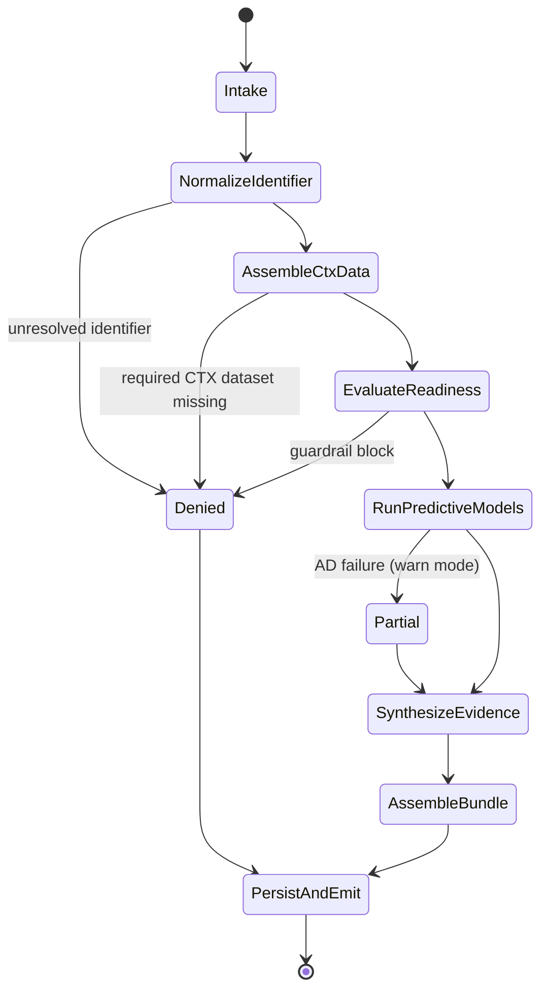
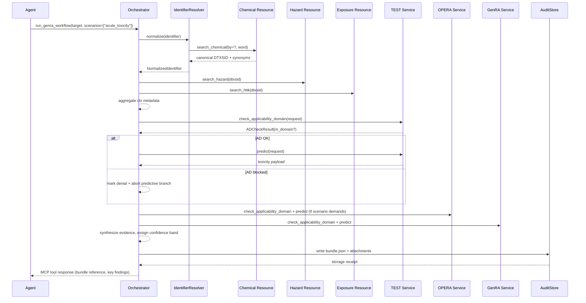

# Experimental GenRA Read-Across Orchestrator Workflow

> Status: experimental design and implementation note.
> This workflow is not part of the default public MCP tool catalog exposed by `src/epacomp_tox/server.py` today.

## Purpose
- Coordinate CTX data retrieval, predictive micro-services, and evidence synthesis into a repeatable read-across (RAx) workflow.
- Enforce applicability-domain (AD) guardrails before any downstream inference, reporting structured denial reasons when the workflow cannot proceed.
- Persist analogue provenance, scoring decisions, and workflow metadata needed for internal regulatory audits.
- Package results as deterministic “audit bundles” consumable by downstream Agentic SDK clients and compliance pipelines.

This design operationalizes the research findings in `research.md` and satisfies Task 4.1 (“Design GenRA workflow specification”) ahead of the implementation subtasks in Task 4.2–4.6.

## Entry Points & Inputs
- **Planned/internal entry point**: `orchestrator.run_genra_workflow`
- **Request contract** (Pydantic-style schema):

```json
{
  "workflowRunId": "uuid (optional – auto-generated when omitted)",
  "target": {
    "identifier": "string",
    "identifierType": "dtxsid | casrn | inchikey | smiles"
  },
  "scenarios": ["acute_toxicity", "exposure_prioritization", "genra_read_across"],
  "options": {
    "fingerprint": "morgan | maccs | toxcast",
    "maxAnalogues": 15,
    "cacheTtlMinutes": 30,
    "requireAdClearance": true,
    "includeRawResponses": false
  },
  "context": {
    "requestedBy": "agent/user id",
    "analysisLabel": "string",
    "regulatoryProgram": "optional string"
  }
}
```

- Unsupported identifiers or scenarios return `422` with structured error payloads.
- `options.requireAdClearance` defaults to `true`; when `false`, the orchestrator still records AD denials but can proceed with warnings.
- This document should not be interpreted as evidence that the workflow is currently registered in the default `tools/list` surface.

## Dependencies
- **Identifier resolution**: `epacomp_tox.resources.chemical` tools (`search_chemical`, `get_chemical_details`) plus planned `IdentifierResolver`.
- **CTX data stage**: `resources.hazard`, `resources.exposure`, `resources.cheminformatics` (batch-enabled).
- **Predictive services**: `TestConsensusPredictiveService`, `OperaPropertyService`, `GenRAService` (already on the shared harness).
- **Metadata**: `ApplicabilityDomainStore`, model cards, and transport metadata from `_with_retry`.
- **Workflow runtime**: new package `epacomp_tox.orchestrator` hosting state machine, caching, and audit bundle writer.
- **Persistence**: planned `audit/genra/<workflowRunId>/bundle.json` plus attachments directory for raw CTX/predictive payloads when requested.

## Workflow State Machine

| State | Responsibilities | Key Calls | Failure Handling |
| --- | --- | --- | --- |
| `Intake` | Validate payload, stamp `workflowRunId`, initialize tracing metadata. | None (internal validation). | Return 400/422 on schema errors. |
| `NormalizeIdentifier` | Resolve requested identifier to canonical DTXSID / DSSTox metadata. | `chemical.search_chemical`, `chemical.get_chemical_details`. | On hard failure emit `denialReason` = `IDENTIFIER_NOT_RESOLVED`. |
| `AssembleCtxData` | Pull hazard, exposure, cheminformatics datasets, cache responses, collect request IDs. | `exposure.search_*`, `hazard.search_*`, `cheminformatics.search_toxprints`. | Partial failures recorded with `dataGaps[]`; fatal if required dataset missing for scenario. |
| `EvaluateReadiness` | Ensure prerequisites satisfied (min analogue coverage, metadata completeness) before predictive stage. | Internal checks + AD preflight (when available). | If coverage inadequate return structured denial (`GENRA_PRECHECK_FAIL`). |
| `RunPredictiveModels` | Sequence TEST, OPERA, and GenRA micro-server calls per scenario with AD gating. | `.check_applicability_domain`, `.predict` on each service. | AD failure short-circuits step when `requireAdClearance=true`; otherwise record warning + continue. |
| `SynthesizeEvidence` | Combine CTX data + predictive outputs into weighted evidence and narrative. | Evidence grading library per research weighting scheme. | Missing ingredients flagged; workflow can proceed with `confidenceBand="Limited"` when configurable. |
| `AssembleBundle` | Compose audit bundle with metadata, timeline, guardrails, attachments. | Local serialization helpers. | Validate bundle against JSON schema before persist. |
| `PersistAndEmit` | Write bundle + attachments, emit reference to transport observers, return MCP response. | File I/O, telemetry hooks. | On storage failure return 500; run is tagged `incomplete`. |



## Sequence Diagram (Acute Toxicity Scenario)



## Applicability Domain & Guardrails
- All predictive calls go through `.check_applicability_domain` first. `PredictiveServiceBase` already enforces block/warn policies from `ApplicabilityDomainStore`; the orchestrator captures the raw `ADCheckResult` plus `metadata["adPolicy"]`, `metadata["adWarning"]` when set.
- When `requireAdClearance=true`, any `.in_domain == false` leads to `denialReason.code = service.metadata["adErrorCode"] or "AD_BLOCKED"`. The workflow stops for that branch and provides remediation hints from the AD definition’s references.
- Pre-predictive guardrails validate analogue coverage: min three analogues at Tanimoto ≥ 0.7, at least two evidence domains, and aligned mode-of-action tags. These checks mirror `metadata/model_cards/genra_read_across.json` and return `GENRA_PRECHECK_FAIL` with actionable details.
- All guardrail events are appended to an ordered `guardrails` array in the audit bundle:

```json
{
  "stage": "RunPredictiveModels",
  "component": "GenRAService",
  "status": "denied",
  "code": "GENRA_AD_FAIL",
  "message": "Analogues below similarity threshold",
  "confidence": 0.34,
  "timestamp": "2025-03-26T17:43:02Z"
}
```

## Data Products & Audit Bundles
- **Bundle schema (draft)**:

```json
{
  "bundleVersion": "0.1",
  "workflowRunId": "uuid",
  "scenario": "genra_read_across",
  "target": {
    "dtxsid": "DTXSID0000001",
    "synonyms": ["CASRN 50-00-0"],
    "inputIdentifier": {
      "value": "50-00-0",
      "type": "casrn"
    }
  },
  "timeline": [
    {"stage": "NormalizeIdentifier", "startedAt": "...", "completedAt": "...", "metadata": {...}}
  ],
  "ctxData": {
    "hazard": {...},
    "exposure": {...},
    "cheminformatics": {...},
    "requestMetadata": [
      {"endpoint": "/hazard/search", "requestId": "abc", "rateLimit": {"limit": 120, "remaining": 118}}
    ]
  },
  "predictive": {
    "test": {"ad": {...}, "prediction": {...}},
    "opera": {...},
    "genra": {"analogues": [...], "prediction": {...}}
  },
  "evidence": {
    "confidenceBand": "Robust",
    "scores": {"analogueCoverage": 0.82, "evidenceQuality": 0.74},
    "narrative": "Weighted read-across indicates ..."
  },
  "guardrails": [...],
  "attachments": [
    {"path": "raw/genra_predict.json", "checksum": "sha256:...", "description": "Raw GenRA response"}
  ]
}
```

- Bundles align with `docs/mcp_ctx_audit.md` by including request IDs, rate-limit headers, and reproducible payload copies when `includeRawResponses=true`.
- Storage layout enables downstream systems to fetch artefacts by `workflowRunId`. Each bundle carries a SHA256 checksum for integrity.

## Failure Modes & Recovery Paths
- **Identifier resolution failed** → return `409` with remediation (provide alternate identifier, consult DSSTox). No CTX calls executed.
- **CTX data gap** → log which dataset is missing (`dataGaps[]`) and either downgrade confidence or deny scenario based on configuration.
- **Rate-limit or transient CTX failures** → automatic retries via `_with_retry`; if exhausted, mark stage with `retryExhausted=true` and stop workflow.
- **Predictive AD block** → default to denial; optionally proceed with warnings when `requireAdClearance=false`.
- **Evidence synthesis error** → capture exception details, emit `confidenceBand="Unavailable"`, and fail the workflow so SMEs can investigate.
- **Audit persistence failure** → attempt one retry with exponential backoff; if still failing, return 500 and emit log event tagged `audit_persist_failure`.

## Implementation Notes & Next Steps
1. **Identifier resolver + cache** (Task 4.2): implement `epacomp_tox.orchestrator.identifiers` with DTXSID canonicalization, DSSTox metadata, and short-term caching.
2. **CTX data stage** (Task 4.2): create `ctx_data.py` that batches hazard/exposure calls, captures `request_id` metadata, and surfaces `dataGaps`.
3. **Predictive coordinator** (Task 4.3): build orchestrator harness that injects `PredictiveRequest`, evaluates AD results, and handles parallel execution with rate-limit guards.
4. **Evidence grading & synthesis** (Task 4.4): encode weighting rules from `research.md` (analogue similarity, evidence diversity, predictive agreement) and compute `confidenceBand`.
5. **Audit bundle writer** (Task 4.5): define JSON schema, persistence strategy, and CLI command to retrieve bundles for audit teams.
6. **Scenario scripts** (Task 4.6): provide CLI/notebook automation calling `run_genra_workflow` for acute toxicity, exposure prioritization, and GenRA RAx demos; record golden outputs.

Cross-cutting tasks: integrate structured logging, update `docs/predictive_services.md` with orchestrator hooks, and extend automated tests to cover success/denial branches plus bundle validation.

## Current Implementation Snapshot (2025-03-26)
- `epacomp_tox.orchestrator.identifiers.IdentifierResolver` resolves input identifiers to canonical DTXSID records with provenance traces and caching.
- `epacomp_tox.orchestrator.ctx_data.CtxDataAssembler` stages hazard/exposure/cheminformatics payloads, recording data gaps and request metadata.
- `epacomp_tox.orchestrator.predictive.PredictiveCoordinator` enforces AD guardrails, normalizes predictive results, and captures telemetry for audit bundles.
- `epacomp_tox.orchestrator.workflow.GenRAOrchestrator` ties the stages together, producing persistent workflow bundles under the configured persistence directory.
- `epacomp_tox.orchestrator.audit.AuditBundleStore` versioned storage with SHA256 checksums plus attachment handling; paired `scripts/genra_bundle_cli.py` lists and retrieves bundles for auditors.
- `epacomp_tox.orchestrator.evidence.EvidenceSynthesizer` converts predictive outputs into confidence bands, score breakdowns, and recommended actions for the audit bundle.
- Observability, audit, and policy requirements tracked in `docs/observability_requirements.md` to guide instrumentation and governance controls.
- Regression tests live in `tests/test_orchestrator_stages.py`, covering identifier caching, CTX data assembly, predictive guardrail scenarios, evidence synthesis, and end-to-end bundle generation.

## Current Implementation Snapshot (2025-03-26)
- `epacomp_tox.orchestrator.identifiers.IdentifierResolver` resolves input identifiers to canonical DTXSID records with provenance traces and caching.
- `epacomp_tox.orchestrator.ctx_data.CtxDataAssembler` stages hazard/exposure/cheminformatics payloads, recording data gaps and request metadata.
- `epacomp_tox.orchestrator.predictive.PredictiveCoordinator` enforces AD guardrails, normalizes predictive results, and captures telemetry for audit bundles.
- `epacomp_tox.orchestrator.workflow.GenRAOrchestrator` ties the stages together, producing persistent workflow bundles under the configured persistence directory.
- Regression tests live in `tests/test_orchestrator_stages.py`, covering identifier caching, CTX data assembly, predictive guardrail scenarios, and end-to-end bundle generation.
